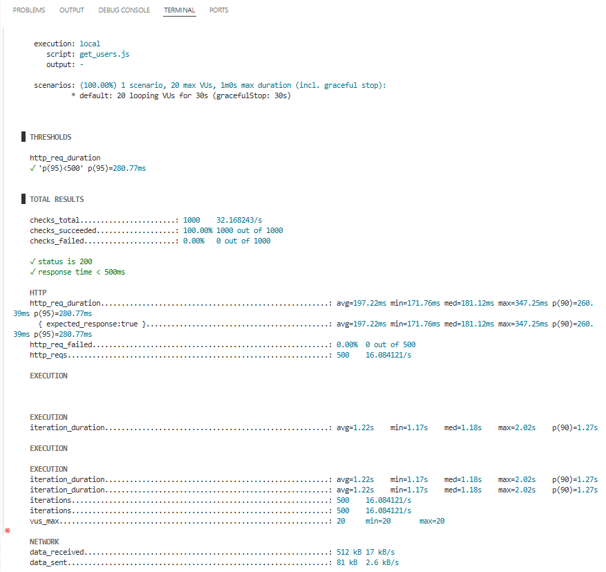
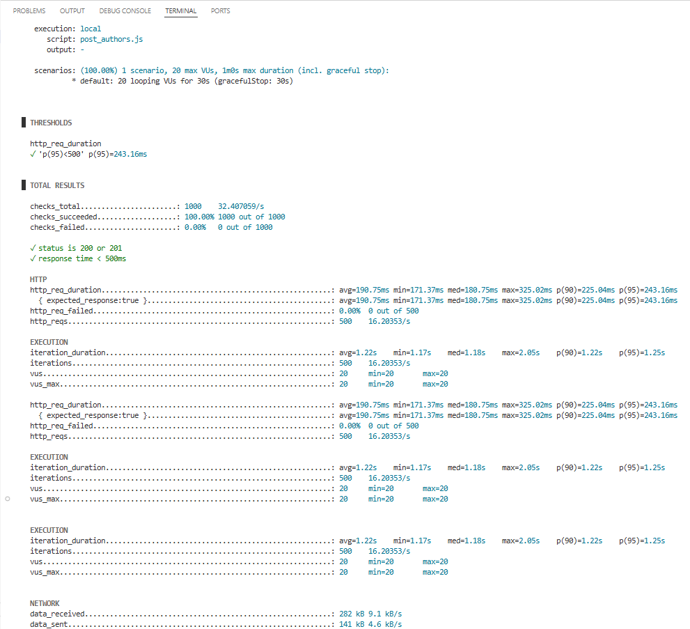

# 📄 Load Testing Summary - QA Final Project K6

## 🛠️ Informasi Umum
- **Nama:** Rudy Kurniawan Efendy
- **Tugas:** Final Project 2 - Load Testing with K6
- **Tools:** K6
- **Durasi Testing:** 30 detik
- **Virtual Users (VUs):** 20 users
- **Threshold:** 95% request < 500ms

---

## ✅ 1️⃣ GET Users
**Endpoint:** `https://fakerestapi.azurewebsites.net/api/v1/Users`

### **Hasil Testing:**
- **Average Response Time:** 197.22ms
- **95th Percentile:** 280.77ms 
- **Error Rate:** 0%
- **Threshold:** Passed ✅

### **Interpretasi:**
Testing menggunakan 20 VUs selama 30 detik menunjukkan semua request dapat diproses di bawah 500ms dan tanpa error. Hal ini menunjukkan endpoint GET Users stabil dan dapat menangani beban paralel dengan baik.

### **GET Users Results:**

---

## ✅ 2️⃣ POST Authors
**Endpoint:** `https://fakerestapi.azurewebsites.net/api/v1/Authors`

### **Hasil Testing:**
- **Average Response Time:** 190.75ms 
- **95th Percentile:** 243.16ms 
- **Error Rate:** 0%
- **Threshold:** Passed ✅

### **Interpretasi:**
Testing dengan 20 users selama 30 detik pada endpoint GET /Users dan POST /Authors menunjukkan semua request stabil di bawah 500ms tanpa error, dengan rata-rata respons 190-197ms dan p95 di bawah 300ms. Hal ini menunjukkan performa server baik untuk penanganan beban paralel.

### **POST Authors Results:**

---

## 🟩 Kesimpulan
Kedua skenario testing (GET dan POST) memenuhi syarat threshold dengan beban 20 VUs selama 30 detik, menunjukkan server stabil dan layak digunakan dalam kondisi penggunaan normal untuk endpoint yang diuji.

---